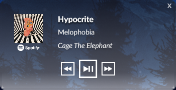
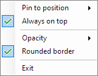

# spiderhead
A simple media visualizer for Windows, built with .NET and WPF.

## Features
### Media Control
This application uses Windows' built-in media control API, and can send the following commands to the current media stream:
- Play/Pause
- Previous
- Next

**NOTE**: The functionality of these commands relies on the compatibility provided by the media hosting application.

### Customizability
Spiderhead's behaviour can be customized from the icon shown in the taskbar by right-clicking, opening the following menu:

- **Pin to position**: Move window to set position or allow to move freely
- **Always on top**: Toggle always on top window behaviour
- **Opacity**: Change the opacity of the window's background
- **Rounded border**: Toggle the rounded border on/off
- **Exit**: Close the current instance of Spiderhead

## Installation
### Build manually
To manually build this application you can follow these steps:

1. Clone this repository

        git clone https://github.com/catneep/spiderhead
        cd spiderhead
        explorer .

1. Open the *.sln* file with Visual Studio
1. Go to Build -> Build Solution (or use `Ctrl + Shift + B`)
1. Navigate to the newly generated *bin* directory
1. Go to Debug/Release (depending on the chosen option in Visual Studio)
1. Search for *spiderhead.exe* and run it

You can also move the generated output directory into your *`Program files`* directory

### Using the installer
Alternatively, you can go to the [**Releases**](https://github.com/catneep/spiderhead/releases) section of this repository and choose the corresponding installer executable.
